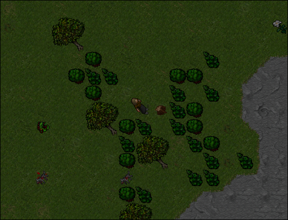

# lenha-a-dor

Automated lumberjack in [Darkrest Online](https://darkrest.online/?news).

Continuously search for map waypoints using image recognition and gather wood.

Features include: `auto lumberjack` and `mana trainer`.
> **Note:** [Lumberjacking](https://darkrest-online.gitbook.io/darkrest.online-wiki/gathering-and-crafting/gathering) is the process of chopping down trees to gather wood.



## Requirements

```bash
pip install pyautogui
pip install keyboard
pip install Pillow
pip install opencv-python
```

## Usage

```python
# Positions of the tree based on character position
right = (1264,426,60,60)    # tree is on the right of character
left = (1198,425,60,60)     # tree is on the left of character
top = (1231,393,60,60)      # tree is on the top of character
bot = (1231,458,60,60)      # tree is on the bottom of character

# Static positions
AXE = (1546, 551)
MANA = (1880, 235, 35, 22)
FOOD = (1583, 549)
MINIMAP = (1728, 31, 183, 182)
```

>**Note:** Execute [locateOnScreen.py](https://github.com/felipevzps/lenha-a-dor/blob/main/locateOnScreen.py) in VSCode to capture coordinates. Hover your mouse over desired locations while the script runs, like Small Axe position in backpack for `AXE`.
>
>You also have to set the waypoints route in your MINIMAP using [screenshot.py](https://github.com/felipevzps/lenha-a-dor/blob/main/screenshot.py)

After adding coordinates to [lenha-a-dor.py](https://github.com/felipevzps/lenha-a-dor/blob/main/lenha-a-dor.py), run the bot in VSCode, minimize it, and press `p` in-game to start fishing.


## Ingame hotkeys

```
Mana trainer (adori vis // adura vita) = F3
```

## Achievements
> Collected more than 13.000 Dried Sticks, 5.000 Sticks, 3.500 Old Woods, 2.400 Roots, 1.600 Strange Roots, 950 Magic Woods and 500 Steel Woods.
